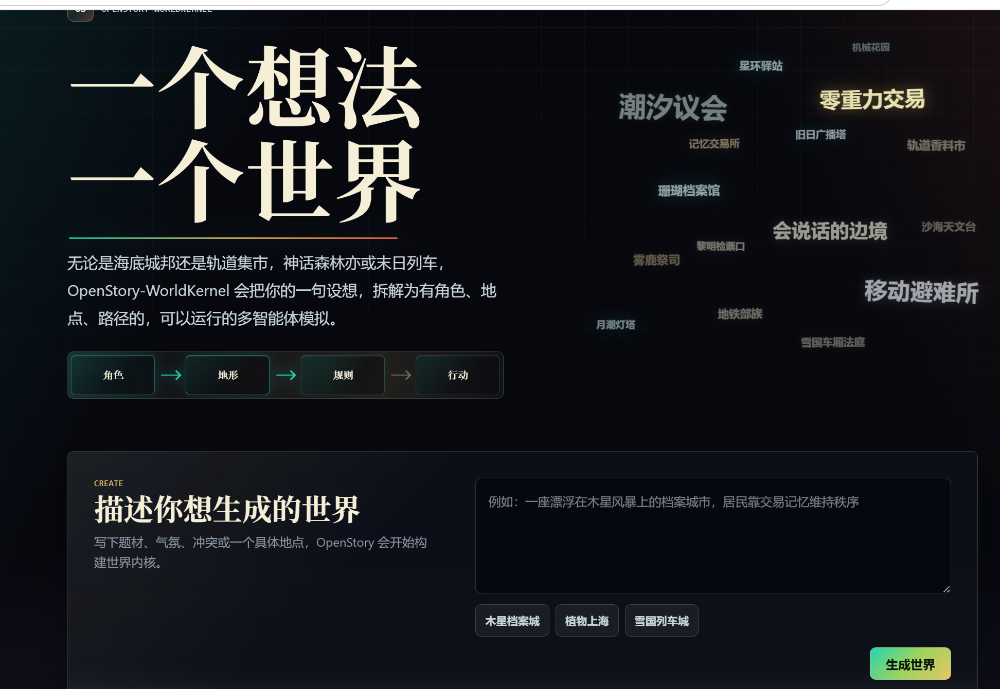
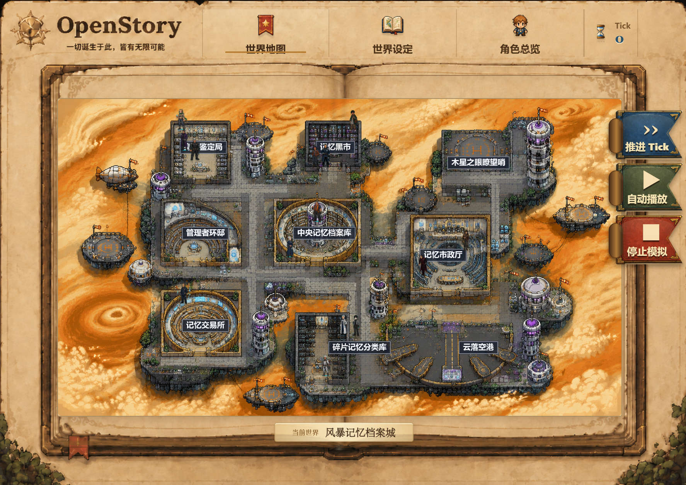
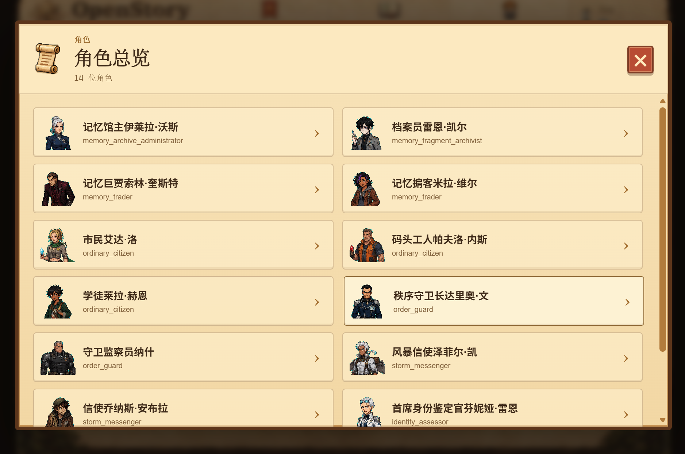

# OpenStory · WorldKernel

> 一个想法，一个世界。

OpenStory · WorldKernel 是一款由一句话开始的世界创造与角色模拟游戏。你只需描述一种题材、一处地点或一个核心冲突，游戏便会围绕这个想法构建世界设定、地点网络与角色群像，让故事在持续推进的时间中自然发生。

## 你可以体验什么

- **一句话创造世界**：从海底城邦、神话森林到末日列车，自由写下你想看到的舞台。
- **观察鲜活的角色**：每位角色都有自己的身份、性格、记忆、目标与社会关系。
- **见证故事自然生长**：角色会根据眼前处境自主计划、行动、交流，并留下新的经历。
- **探索完整的世界地图**：地点与道路共同构成可观察的活动空间，事件会在真实位置上发生。
- **参与世界的走向**：逐步推进 Tick、连续播放模拟，或为角色指定下一步行动，看看一次干预会带来怎样的连锁变化。

## 从一个念头到一段故事

1. **描述世界**：写下题材、气氛、冲突，或者一个让你好奇的地点。
2. **进入地图**：查看世界中的区域、道路，以及角色所在的位置。
3. **认识角色**：了解他们的背景、愿望、秘密与彼此之间的关系。
4. **推进时间**：每个 Tick 都可能产生移动、相遇、对话、受阻或其他事件。
5. **观察变化**：行动会成为记忆，记忆又会影响之后的选择，故事因此不断演化。

## 示例世界：风暴记忆档案城

这是一座漂浮在木星风暴之上的档案城市。记忆既是居民的身份凭证，也是可以买卖的通货。中央记忆档案库维持着全城秩序，记忆交易所昼夜运转，黑市则让被禁止的过去悄然流通。

当档案库发现一次未经授权的深层写入，整座城市陷入身份危机：谁的记忆是真实的？谁正在改写他人的人生？档案员、商人、守卫、信使与普通市民都将按照自己的立场采取行动，而答案会在一次次相遇与选择中逐渐浮现。

## 这不是一条写好的故事线

世界没有唯一的主角，也没有固定的结局。角色可能合作、隐瞒、交易、冲突，也可能因为一段新记忆或一次偶然相遇改变原本的计划。你既可以作为旁观者观看群像故事展开，也可以在关键时刻推角色一把。

每一次创造，都是一段只属于这个世界的历史。
