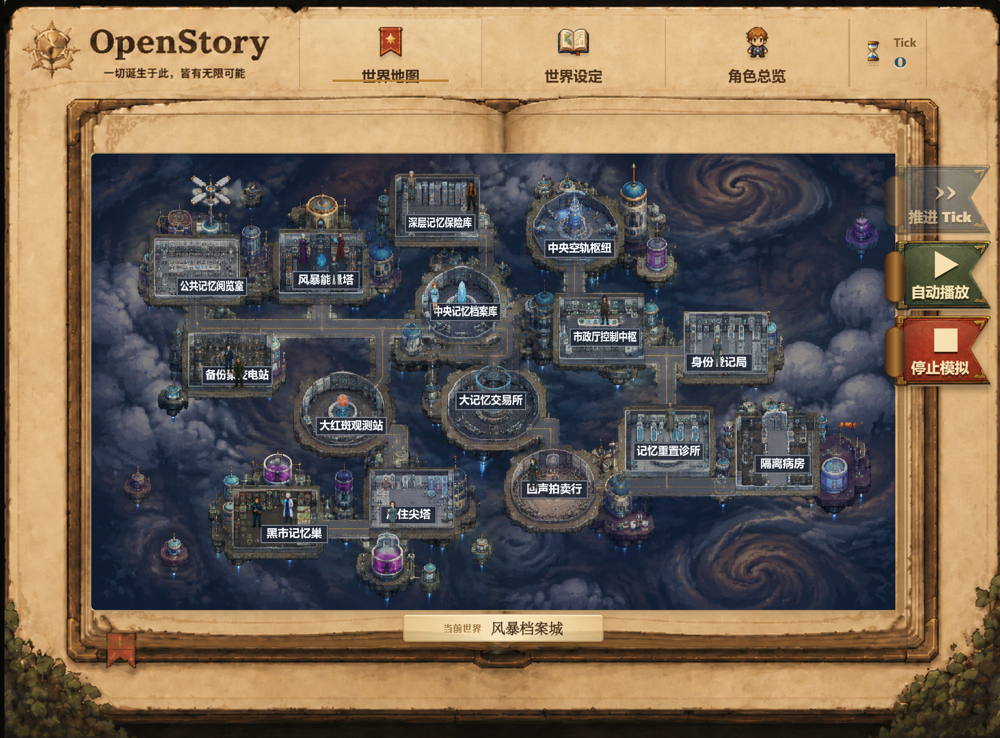
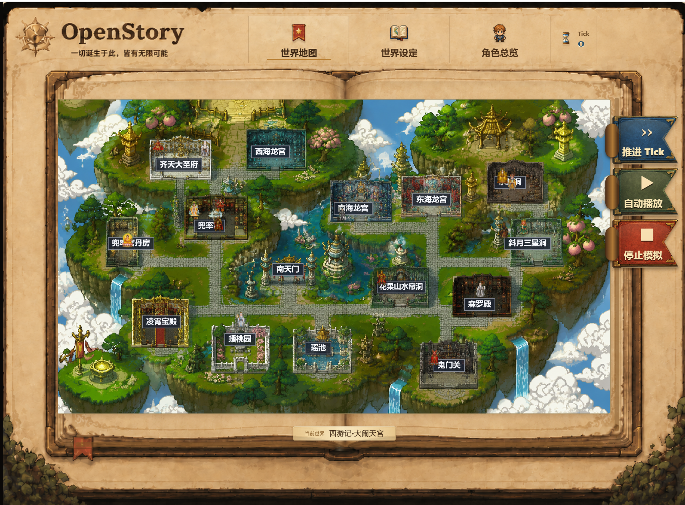
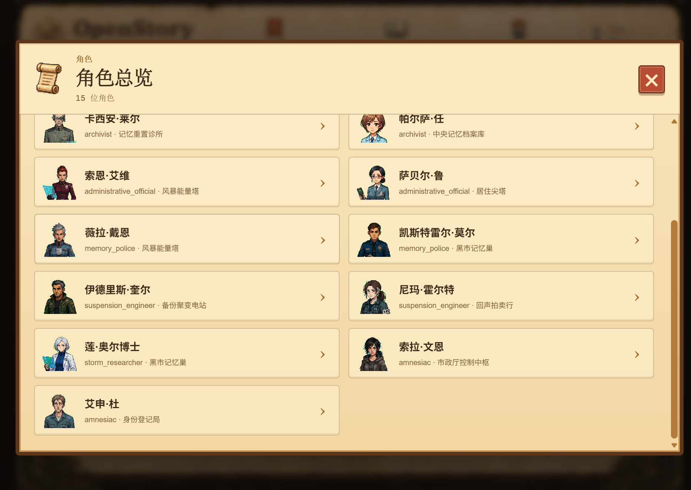
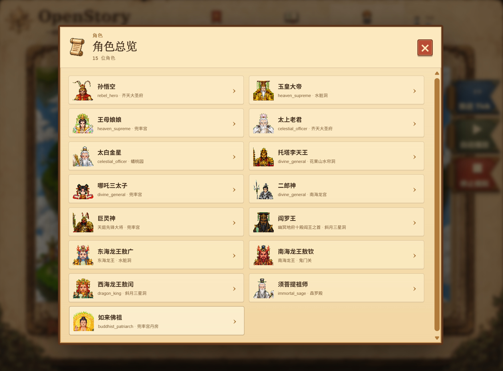
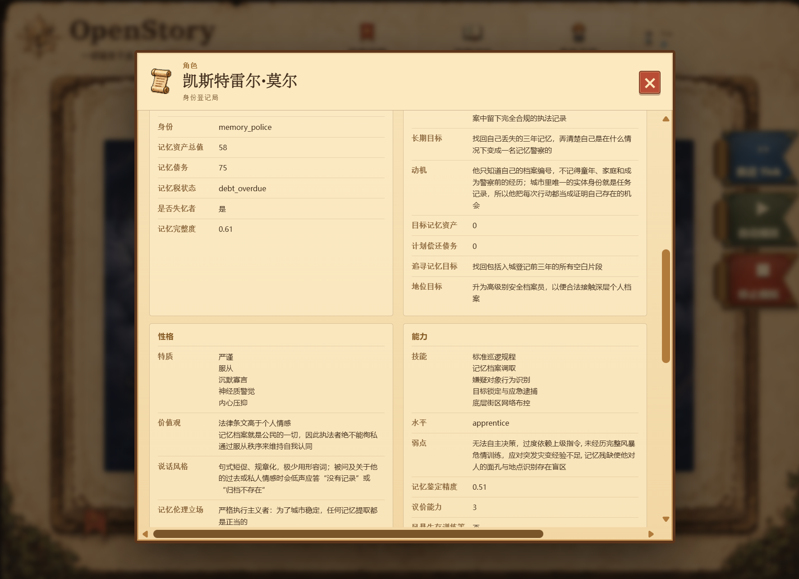
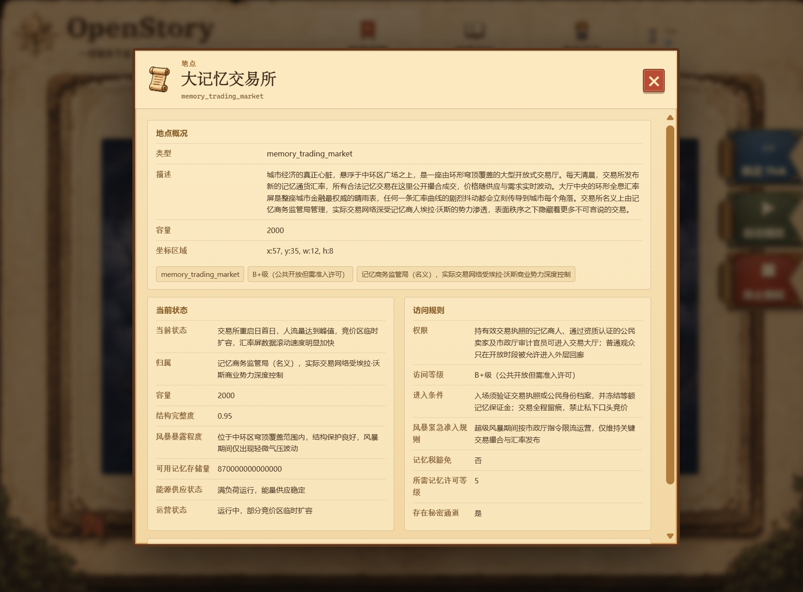
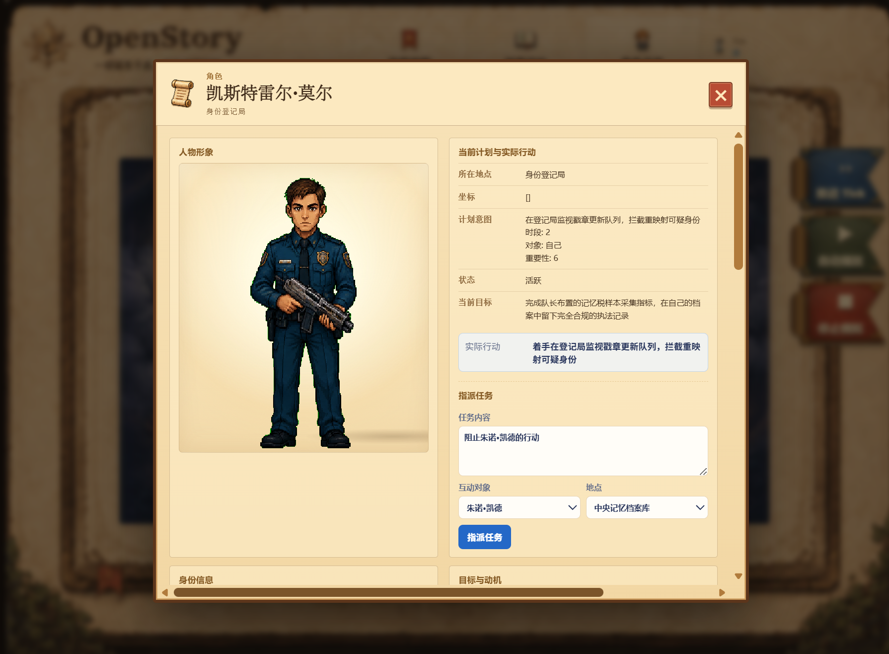
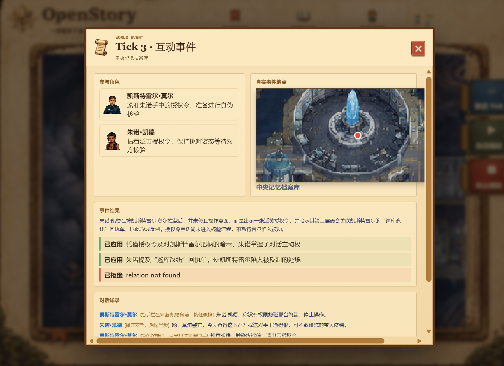

# OpenStory · WorldKernel

> 一个想法，一个世界。

OpenStory · WorldKernel 是一款由一句话开始的世界创造与角色模拟游戏。你只需描述一种题材、一处地点或一个核心冲突，游戏便会围绕这个想法构建世界设定、地点网络与角色群像，让故事在持续推进的时间中自然发生。

## 从一个念头到一段故事

1. **描述世界**：写下题材、气氛、冲突，或者一个让你好奇的地点。
2. **进入地图**：查看世界中的区域、道路，以及角色所在的位置。
3. **认识角色**：了解他们的背景、愿望、秘密与彼此之间的关系。
4. **推进时间**：每个 Tick 都可能产生移动、相遇、对话、受阻或其他事件。
5. **观察变化**：行动会成为记忆，记忆又会影响之后的选择，故事因此不断演化。

任何你想象中的世界在这里都可以实现：既可以是围绕记忆、身份与秩序展开的科幻城市，也可以是仙宫、龙宫与妖魔共存的东方神话世界。每个世界都会拥有符合自身风格的地图、地点和人物阵容。

| 科幻世界 · 风暴记忆档案城 | 神话世界 · 西游记·大闹天宫 |
| :---: | :---: |
|  |  |
|  |  |
|  |  |
|  |

## 示例：风暴记忆档案城

这是一座漂浮在木星风暴之上的档案城市。记忆既是居民的身份凭证，也是可以买卖的通货。中央记忆档案库维持着全城秩序，记忆交易所昼夜运转，黑市则让被禁止的过去悄然流通。

当档案库发现一次未经授权的深层写入，整座城市陷入身份危机：谁的记忆是真实的？谁正在改写他人的人生？档案员、商人、守卫、信使与普通市民都将按照自己的立场采取行动，而答案会在一次次相遇与选择中逐渐浮现。

## 翻阅世界档案

生成的世界并不只是一张地图。游戏会为其中的人物和地点建立可以随时查阅的详细档案，让这个世界拥有足够丰富的背景，也让每一次行动都有迹可循。

### 人物档案

每位人物都有独立的身份、经历与行为逻辑。人物档案会记录他们的性格、价值观、能力、目标、动机和记忆状态等内容。不同人物对同一件事可能有完全不同的判断，他们也会依照自身立场作出选择。

### 地点档案

地图中的地点同样拥有自己的背景和规则。地点档案会介绍区域用途、当前状态、所属势力、访问条件与潜在风险。角色能否进入某处，以及在那里可能发生什么，都与这些设定有关。

## 指派人物，影响故事

除了观察人物自主行动，你还可以选择一个人物，为其指定任务、互动对象和目标地点。指令会作为人物下一步行动的重要依据，但任务如何执行、对方如何回应，以及最终能否成功，仍会受到人物性格、关系、地点规则与现场状况的影响。

## 查看事件的发生与结果

推进 Tick 后，人物的行动与互动会形成世界事件。事件记录会展示参与人物、真实发生地点、行动结果和现场对话，也会标明哪些效果已经生效、哪些尝试遭到拒绝。一次看似简单的指派，也可能引发新的矛盾、关系变化或后续行动。

## 这不是一条写好的故事线

世界没有唯一的主角，也没有固定的结局。角色可能合作、隐瞒、交易、冲突，也可能因为一段新记忆或一次偶然相遇改变原本的计划。你既可以作为旁观者观看群像故事展开，也可以在关键时刻推角色一把。

每一次创造，都是一段只属于这个世界的历史。
