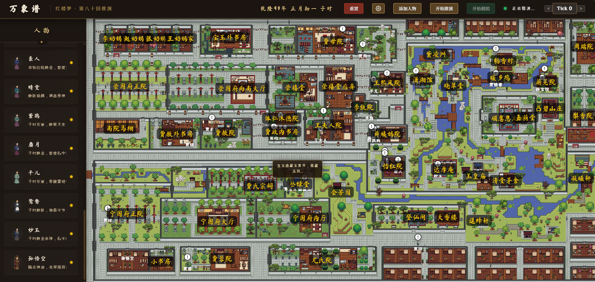
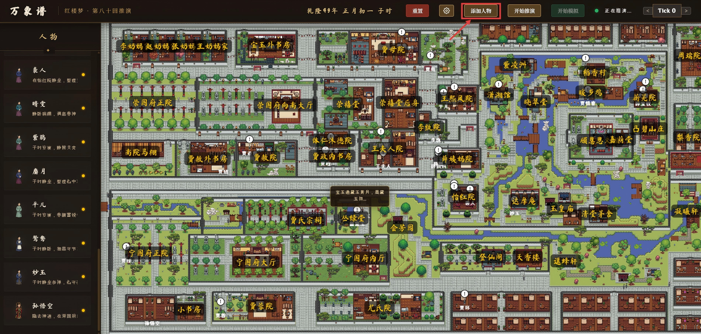
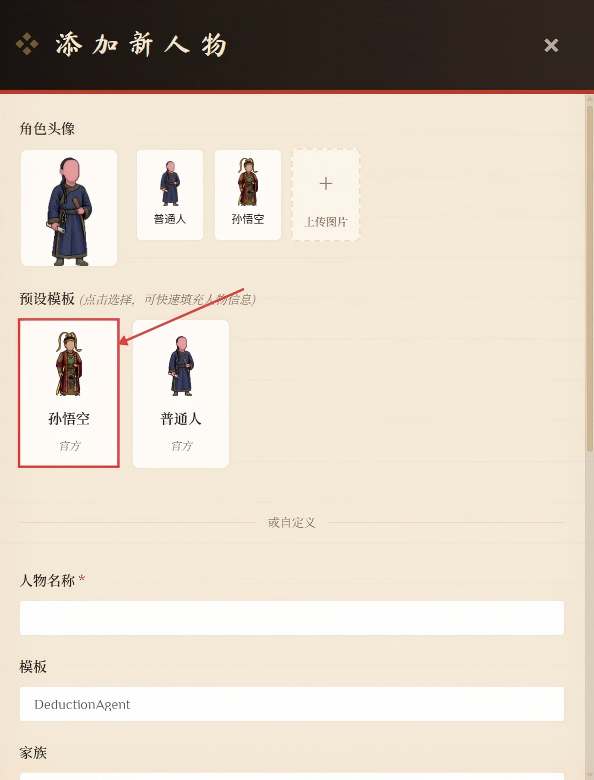
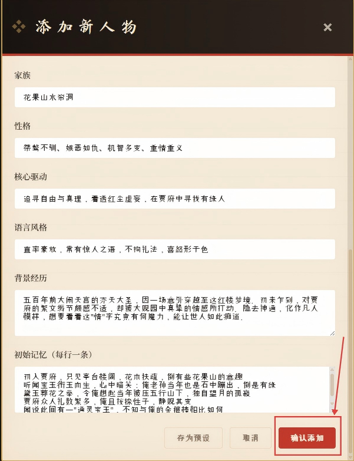
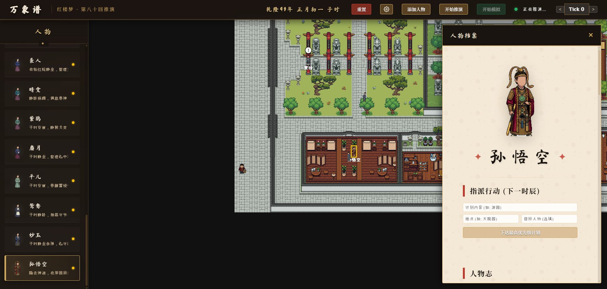
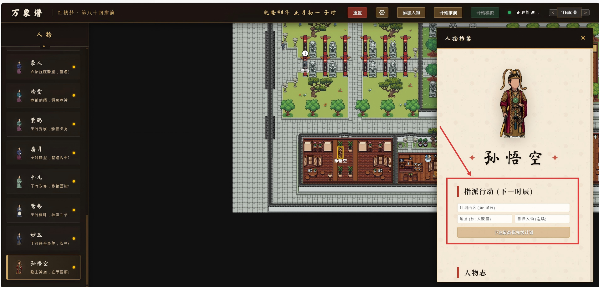
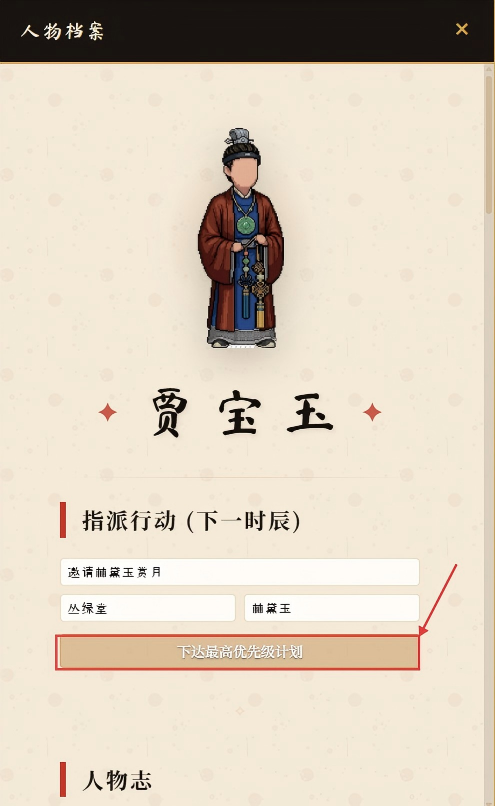
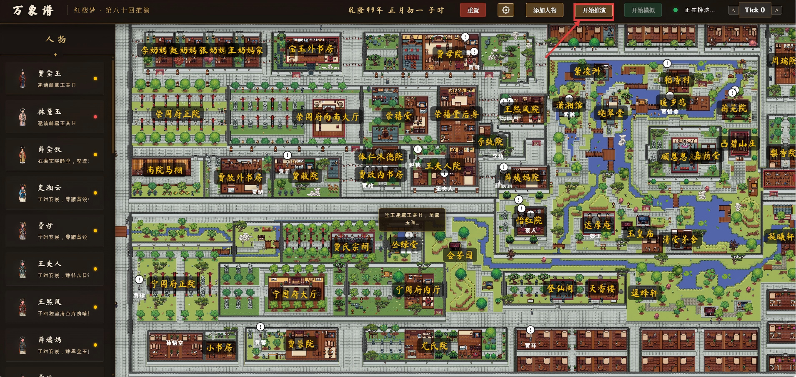
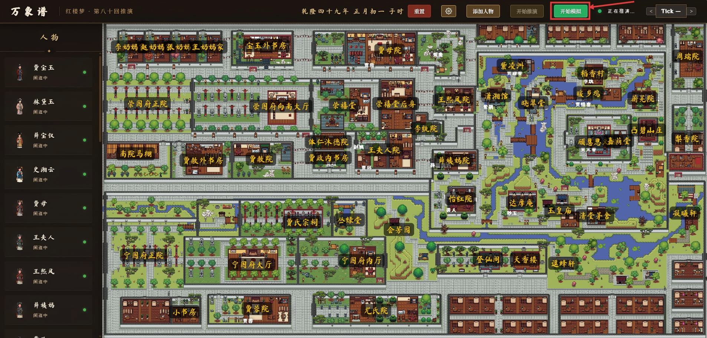

# OpenStory: The Story of the Stone Tutorial

## 1. Introduction

Welcome to the **OpenStory: The Story of the Stone Tutorial**! This guide will take you step-by-step through exploring and "playing" in the sandbox world of *The Story of the Stone* (also known as *Dream of the Red Chamber*). From setting up your environment to engaging in interactive storytelling, we provide detailed instructions for every step. Whether you want to quickly experience the classic tale or develop and customize your own unique storylines, this tutorial will help you get started with ease.

## 2. Quick Start

After configuring your environment and API according to the QuickStart guide, activate your virtual environment and run the following command to start the project:

```bash
python -m examples.story_of_the_stone.run_simulation
```

Once you see the following message in your terminal, the server has started successfully:
> `API Server started at http://0.0.0.0:8000`

Now, open the following link in your web browser:

👉 [http://localhost:8000/frontend/index.html](http://localhost:8000/frontend/index.html)

You will be greeted with the main operation interface:



---

## 3. Core Features

### 3.1 Adding Characters

You can introduce new characters into the world using the following steps:

1. **Click the "Add Character" button** to open the character creation panel.
   
2. **Select a template or customize**: Choose from official avatars and templates, or fill in the character's information yourself. Here, we use the official "Sun Wukong" (Monkey King) template as an example.
   
3. **Confirm Addition**: Once the information is filled out, click "Confirm Add".
   
4. **Success**: You can now see that the character has successfully entered the world of *The Story of the Stone*!
   

### 3.2 Assigning Actions

Want a character to perform a specific task? Set it up in the **"Assign Action"** section of the character's profile:

- **Plan Details**: Feel free to be creative and describe the specific action you want the character to take.
- **Location**: It is highly recommended to select an existing location on the map for the best interaction results.
- **Target Character**: Limit to one target character (you can enter a character that does not currently exist on the map).



Once filled out, click the **"Issue Highest Priority Command"** button.



> **💡 Tip:** The plan is now successfully added to the character's schedule. It will be automatically executed during the next deduction tick.

### 3.3 Deduction & Simulation

It's time to watch the story unfold:

1. **Start Deduction**: Click the "Start Deduction" button on the interface.
   
2. **Wait for Simulation Readiness**: The system requires some time for background calculations. Please wait patiently until the "Start Simulation" button turns green.
3. **Launch Simulation**: Click the green "Start Simulation" button to set the world in motion.
   
4. **View the Results**: After the deduction is complete, feel free to randomly open the profiles of different agents to see what interesting things they have done during this round!
